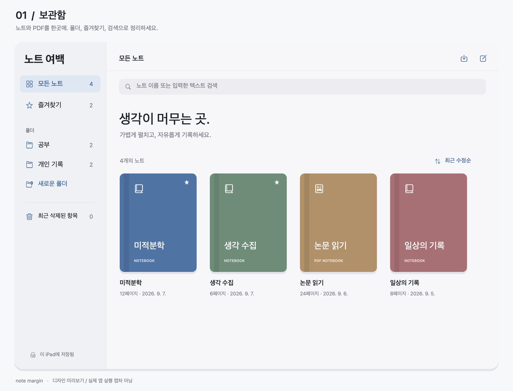
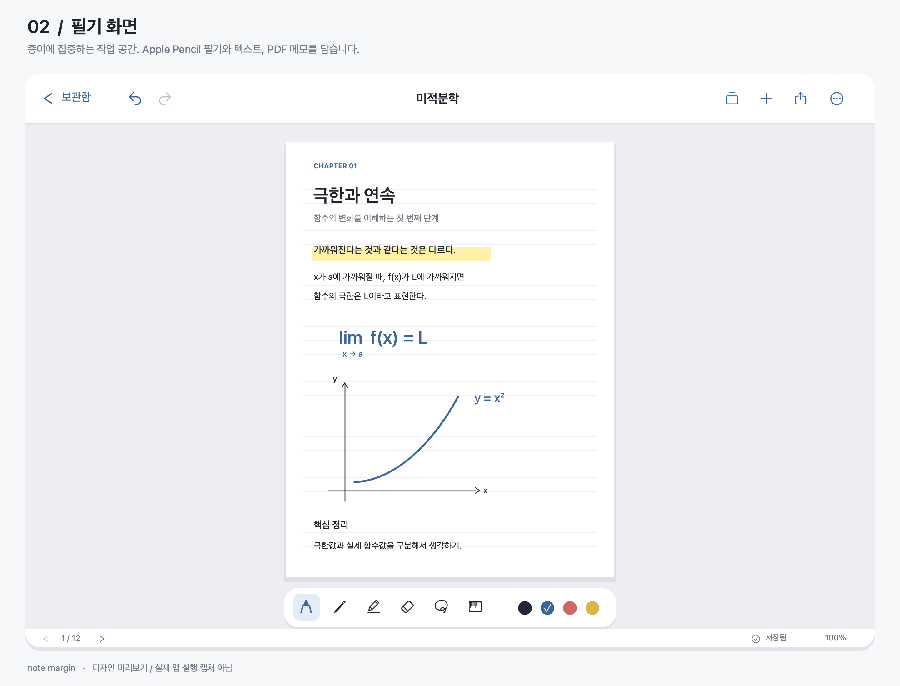

# 노트 여백 · note margin

iPad와 Apple Pencil을 위한 설치형 필기앱입니다. SwiftUI, PencilKit, PDFKit을 사용하며, 필기·보관함은 오프라인으로 동작합니다. 여백 AI 대화는 사용자의 OpenAI 또는 Gemini API 키로 연결합니다.

**노트 여백 · note margin**은 ‘노트의 여백에서 AI와 상호작용하며 학습한다’는 의미를 담고 있습니다. 프로젝트별로 노트를 정리하고, 선택한 PDF와 필기 영역에 대해 AI와 대화할 수 있습니다. 질문은 여백의 원형 아이콘으로 열고 닫습니다.

기기 언어가 한국어이면 앱 이름은 **노트 여백**, 영어이면 **note margin**으로 표시됩니다.

**현재 상태:** 프로젝트 관리·여백 AI 구현, Core 검증 30개 및 과금 없는 API 형식 검사 31개 통과, iPad 시뮬레이터 Debug 빌드 성공. 기존 긴 PDF 필기·페이지 잔상·획 지우개 UI 3개와 새 여백 대화 UI 2개 검사 통과. 실제 API 키를 이용한 응답과 실제 Apple Pencil 입력은 별도 확인이 필요합니다. 서명된 `.ipa`는 포함하지 않습니다.

## 화면 미리보기

AI 기능 추가 전 SwiftUI 구현을 바탕으로 제작한 **디자인 미리보기**입니다. 실제 iPad 앱 실행 캡처는 아니며, 예시 노트와 필기 내용을 사용했습니다. PencilKit 도구 팔레트는 아이콘으로 간략하게 표현했습니다.

### 보관함

폴더와 즐겨찾기로 노트를 정리하고, 이름이나 입력한 텍스트를 검색합니다.



### 필기 화면

페이지를 확대해 필기하고 텍스트·사진을 삽입합니다. 상단에서 페이지 관리와 공유, 하단에서 페이지 이동과 저장 상태를 확인할 수 있습니다.



## 구현한 기능

| 영역 | 기능 |
| --- | --- |
| 보관함 | 노트 생성, 이름·표지 변경, 복제, 즐겨찾기 |
| 프로젝트 | 프로젝트 생성·이름 및 에이전트 지침 변경·삭제, 노트 할당·이동, 프로젝트별 필터 |
| 여백 AI | 사각형 선택·이동·크기 조절, PDF·필기·텍스트·사진 영역 미리보기, 원형 대화 아이콘, 후속 질문·중단·재시도 |
| AI 연결 | OpenAI Responses / Gemini generateContent, 앱 전체 공급자·모델 설정, 개인 API 키의 Keychain 저장 |
| 정리 | 폴더 생성·이름 변경·삭제, 노트 이동, 이름·입력 텍스트 검색, 정렬 |
| 삭제 | 휴지통 이동, 복원, 확인 후 영구 삭제 |
| 필기 | PencilKit 기본 펜·연필·형광펜·지우개·올가미·자, 색상·굵기, 필기 실행 취소·다시 실행 |
| 입력 | Apple Pencil 우선, 손가락 필기 설정, 확대·이동, 용지 맞추기, 세 손가락 좌우 페이지 넘김 |
| 용지 | 무지·줄·격자·도트, 페이지 추가·복제·삭제·순서 변경 |
| PDF | 파일 앱·다른 앱에서 가져오기, 여러 페이지를 하나로 이어 붙이기 또는 페이지별 보기 선택, PDF 위 필기 |
| 삽입 | 텍스트·사진 추가, 위치·크기·글자 크기 편집, 끌어서 이동, 삭제 |
| 저장·공유 | 로컬 자동 저장, 전체 노트 PDF 공유, 현재 페이지 PNG 공유 |
| 시스템 | 가로·세로 방향, 크기 변화 대응, 시스템 다크 모드, 한국어 UI, VoiceOver 레이블 |

도구 팔레트의 세부 구성은 실행하는 iPadOS 버전에 따라 달라질 수 있습니다. 필기 검색/OCR, 노트 전체·페이지 범위 요약, 별표 우선 인식, 강의 녹음, iCloud 동기화는 포함하지 않았습니다. 텍스트·사진 편집은 별도의 항목 편집 기능이며 실행 취소 버튼은 필기 작업에 적용됩니다.

**획 지우기:** 지우개가 닿은 획은 누르고 있는 동안 반투명하게 유지되고, 지나간 범위는 흰색으로 표시됩니다. 지우개를 떼면 닿았던 획 전체가 삭제되며 실행 취소 한 번으로 복원할 수 있습니다. 흰색 자국은 저장되지 않습니다. 픽셀 지우개는 기존 방식으로 동작합니다.

## 프로젝트와 여백 AI 사용하기

1. 보관함 사이드바의 **AI 연결**에서 OpenAI 또는 Gemini를 고릅니다. 제공사 링크에서 발급한 본인의 API 키를 입력하고 **연결 설정 저장**을 누릅니다. ChatGPT/Gemini 구독 로그인과 별개이며, **API 사용료가 별도**로 발생합니다. 저장됨 표시는 키가 기기에 저장되었다는 의미이며, 실제 권한·잔액은 전송 시 확인됩니다.
2. **새 프로젝트**를 만들고 프로젝트 에이전트 지침을 입력합니다. 예: “대학 1학년 수준으로, 풀이 과정을 먼저 설명해 줘.” 프로젝트 안에서 새 노트를 만들거나 PDF를 가져옵니다. 기존 노트는 길게 눌러 **프로젝트로 이동**을 선택합니다.
3. 노트의 작은 **질문** 버튼을 누릅니다. 사각형 안을 끌어 이동하고 모서리를 끌어 크기를 바꾼 다음 **이 영역으로 질문**을 누릅니다.
4. 열린 대화에서 **선택 영역 보기**로 PDF와 필기가 합쳐진 이미지 및 추출 텍스트를 확인합니다. 질문을 입력하고 전송합니다.
5. 여백의 원형 아이콘을 누르면 해당 대화가 열리고, 다시 누르면 닫힙니다. 페이지의 대화 목록에서도 다시 열 수 있습니다. 작성 중인 질문과 대화는 기기에 저장됩니다.

선택 영역은 **선택한 시점**의 PDF 배경·필기·삽입 텍스트·사진을 함께 담습니다. 선택 영역의 PDF 텍스트도 추출해 이미지와 함께 전송합니다. 손글씨는 이미지 인식으로 읽으며, 별도의 필기 OCR이나 다른 페이지 전체를 자동 수집하는 기능은 없습니다. 캡처 후 추가한 필기를 질문하려면 새 영역을 선택하세요. 아주 넓은 영역은 최대 1800픽셀로 축소되므로 작은 글씨는 영역을 좁히는 편이 좋습니다.

프로젝트 학습 지침은 해당 프로젝트의 대화에 공통으로 적용됩니다. **각 대화에는 선택 영역과 해당 대화 기록, 프로젝트 지침만 전송**하며, 다른 프로젝트나 다른 노트 전체의 대화 기록을 자동으로 합치지 않습니다. 노트를 다른 프로젝트로 옮기면 새 프로젝트에 새 대화를 만들 수 있고, 이전 프로젝트 대화는 목록에서 읽기 전용으로 확인합니다. 프로젝트를 삭제해도 노트는 보존됩니다.

연결은 앱 전체에서 한 번 설정합니다. 키는 이 iPad 전용 Keychain에 저장되고 동기화되지 않으며, 코드나 노트 파일에 기록하지 않습니다. 질문은 선택한 제공사의 공식 HTTPS API로 직접 전송합니다. 앱 자체 중계 서버는 없습니다. 자세한 요청 형식은 [OpenAI 이미지 입력 안내](https://developers.openai.com/api/docs/guides/images-vision)와 [Gemini generateContent 문서](https://ai.google.dev/api/generate-content)를 참고하세요.

## Xcode에서 실행

대상은 **iPadOS 17 이상**, 프로젝트 편집 도구는 **Xcode 16 이상**입니다. 연결할 iPadOS 버전을 지원하는 Xcode를 사용하세요.

1. Mac에 Xcode를 설치하고 최초 실행 설정에서 iOS 플랫폼을 설치합니다.
2. 이 폴더의 `NoteMargin.xcodeproj`를 엽니다. `Package.swift`는 Core 검증용입니다.
3. `NoteMargin` 스킴과 사용할 iPad 시뮬레이터를 선택하고 `⌘R`로 빌드·실행합니다.
4. 실제 iPad에 설치하려면 Xcode 설정에서 Apple 계정에 로그인하고, 앱 타깃의 **Signing & Capabilities → Team**에서 본인 팀을 선택합니다. 기본 Bundle Identifier `com.yeobaek.notes`는 본인 계정의 고유한 값으로 변경하세요.
5. iPad를 Mac에 연결해 신뢰 설정을 완료하고, 필요한 경우 iPad의 개발자 모드를 활성화합니다. 실행 대상으로 해당 iPad를 선택한 뒤 `⌘R`을 누릅니다.

실기기 실행에는 코드 서명 설정이 필요합니다. 절차는 [Apple의 기기 실행 안내](https://developer.apple.com/documentation/Xcode/running-your-app-on-simulated-or-physical-devices)를 따릅니다.

시뮬레이터에서 마우스로 필기할 때는 노트의 **더 보기 → 손가락으로도 필기**를 켭니다. 실제 Pencil의 압력·기울기·손바닥 입력 처리는 실기기에서 확인해야 합니다.

Xcode가 설치된 환경의 서명 없는 빌드 검사:

```sh
xcodebuild -project NoteMargin.xcodeproj -scheme NoteMargin \
  -configuration Debug -sdk iphonesimulator \
  -destination 'generic/platform=iOS Simulator' \
  -derivedDataPath /tmp/NoteMarginDerivedData CODE_SIGNING_ALLOWED=NO buil
```

## 사용 흐름

- 보관함의 새 노트 버튼에서 이름, 표지, 첫 페이지 용지를 선택합니다.
- 노트를 길게 누르면 폴더 이동·복제·즐겨찾기·휴지통 메뉴가 나타납니다.
- 필기 화면에서 PencilKit 팔레트로 도구를 고릅니다. 손가락 필기를 끈 상태에서는 손가락 하나로 페이지를 이동할 수 있습니다. 손가락 필기 또는 항목 이동 모드에서는 두 손가락으로 화면을 이동합니다.
- 상단 페이지 버튼에서 다른 페이지를 선택합니다. **편집**으로 순서를 바꾸고 `+`로 페이지를 추가합니다.
- 상단 `+`에서 텍스트·사진을 삽입합니다. **텍스트·사진 이동**은 드래그하는 동안 도착 위치의 테두리를 보여주고 손을 떼면 이동을 저장합니다. 항목 편집에서는 위치·크기를 숫자 슬라이더로 조절합니다.
- 공유 버튼에서 전체 PDF나 현재 페이지 이미지를 만들어 파일 앱·AirDrop 등으로 공유합니다.

## PDF를 펼치는 두 가지 방식

PDF가 2페이지 이상이면 가져오기 전에 선택 화면이 나타납니다. 1페이지 PDF는 바로 열립니다.

- **하나로 이어 붙이기:** 원래 순서와 페이지 비율을 유지하며 세로로 연결한 긴 용지에 필기합니다. 처음에는 너비에 맞춰 열리고 위아래로 스크롤합니다. 원본 PDF 파일은 그대로 보존합니다.
- **페이지별로 보기:** 원래 페이지를 유지합니다. 필기 화면에서 **세 손가락으로 왼쪽으로 쓸면 다음 페이지**, **오른쪽으로 쓸면 이전 페이지**로 이동합니다. 첫 안내는 잠시 표시되고, 하단 손 아이콘으로 다시 확인할 수 있습니다. 기존 화살표 버튼도 사용할 수 있습니다.

세 손가락 페이지 넘김은 텍스트·사진 이동 중이나 시트가 열린 동안에는 동작하지 않습니다. 해당 필기 화면에서는 시스템의 세 손가락 실행 취소 대신 페이지 넘김을 사용하며, 실행 취소·다시 실행은 상단 버튼 또는 키보드 단축키로 할 수 있습니다. VoiceOver 사용 시에는 하단 페이지 버튼을 사용할 수 있습니다.

이어 붙인 용지는 저장·복제·공유에도 유지됩니다. PDF 공유는 긴 한 페이지로 내보내며, PNG는 긴 쪽을 최대 4096픽셀로 축소합니다. 아주 긴 PDF는 PDF 형식으로 공유하는 편이 읽기 좋습니다.

## 저장 방식

앱의 Documents 아래 `NoteMargin` 폴더에 저장합니다.

이름 변경 전 버전의 보관함은 첫 실행 시 새 폴더로 이동합니다. 기존 설치 앱과 저장 데이터의 연속성을 위해 내부 Bundle Identifier는 유지합니다.

```text
NoteMargin/
  library.json
  MarginChats/
    <노트 UUID>/
      <대화 UUID>.json
  <노트 UUID>/
    <페이지 UUID>.drawing
    original.pdf
    <이미지 UUID>.jpg
```

필기 변경 후 350ms 동안 새 변경이 없으면 저장하며, 페이지 전환·노트 닫기·앱 비활성화 때 남은 변경을 저장합니다. 저장은 파일의 원자적 교체를 사용합니다. 저장 실패 시 메모리의 필기 데이터를 유지하고 오류를 표시합니다. 이미 손상된 보관함은 덮어쓰지 않고, 읽지 못하는 필기·누락된 PDF 페이지는 편집을 막습니다.

노트 복제는 원본과 별도 폴더로 파일을 복사하며, AI 대화는 복사하지 않습니다. AI 대화 파일에는 선택 이미지·추출 텍스트·메시지·작성 중 질문이 함께 저장됩니다. 대화 하나를 원자적으로 저장하고, 손상된 대화는 덮어쓰지 않습니다. 노트를 영구 삭제하면 해당 AI 대화도 삭제합니다. 페이지 삭제 후 남은 첨부 파일은 노트를 영구 삭제할 때 정리합니다. 휴지통은 자동으로 비워지지 않습니다.

파일 공유를 활성화해 파일 앱/Finder에서 Documents에 접근할 수 있습니다. 편집 가능한 자료를 보관하려면 앱을 닫은 상태에서 `NoteMargin` 폴더 전체를 복사하세요. PDF 내보내기는 배경 PDF와 입력 텍스트를 렌더링하고 필기 레이어는 이미지로 합칩니다. 내보낸 PDF를 다시 가져오면 기존 필기는 PDF 배경의 일부가 됩니다.

## 검증과 유지보수

Core 검증은 XCTest가 없는 Command Line Tools 환경에서도 실행할 수 있습니다.

```sh
swift run --scratch-path /tmp/note-margin-swift-build CoreChecks
```

API 형식 검사는 실제 키와 네트워크 요청 없이 실행합니다.

```sh
swiftc NoteMargin/Services/AIConnectionStore.swift NoteMargin/Services/AIClient.swift \
  scripts/ai_wire_checks.swift -o /tmp/note-margin-ai-wire-checks
/tmp/note-margin-ai-wire-checks
```

PDF 영역 합성 및 UI 회귀 검사:

```sh
python3 scripts/check_pdf_import.py
python3 scripts/check_pdf_import.py --live-ui
```

Swift 소스를 추가한 뒤 Xcode 프로젝트를 재생성하려면:

```sh
python3 scripts/generate_project.py
```

재생성은 프로젝트 설정을 기본값으로 덮어씁니다. 직접 수정한 Team·Bundle Identifier 등은 다시 적용하거나 생성 스크립트에 반영하세요.

앱의 실제 사용 검증 항목은 `QA.md`에 정리했습니다. 현재 Core 검증 결과가 iPad 화면·PencilKit 동작 검증을 대신하지는 않습니다.

## 설계 기준

보관함은 시스템 사이드바와 탐색 구조, 편집 화면은 시스템 툴바와 기본 필기 도구를 사용합니다. 시스템 글꼴·SF Symbols·의미 기반 배경색을 사용하고 콘텐츠를 중심에 둡니다. 필기 용지는 다크 모드에서도 흰색을 유지해 검은 잉크와 PDF의 표시를 일관되게 합니다.

- [Apple Human Interface Guidelines: Split views](https://developer.apple.com/design/human-interface-guidelines/split-views)
- [Apple Human Interface Guidelines: Toolbars](https://developer.apple.com/design/human-interface-guidelines/toolbars)
- [PKCanvasView](https://developer.apple.com/documentation/pencilkit/pkcanvasview)
- [PKToolPicker](https://developer.apple.com/documentation/pencilkit/pktoolpicker)
