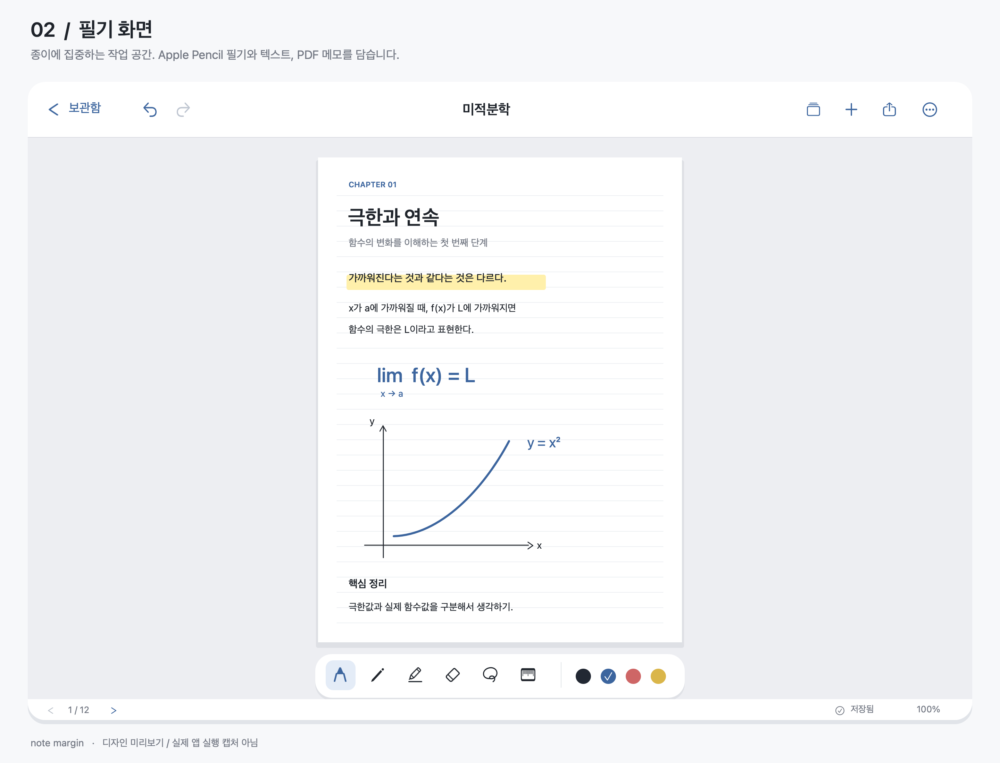

# 노트 여백 · note margin

iPad와 Apple Pencil을 위한 설치형 필기앱입니다. SwiftUI, PencilKit, PDFKit을 사용하며, 필기·보관함은 오프라인으로 동작합니다. AI 연결은 모든 앱에서 **ChatGPT 구독 연결**로 통합했습니다.

**노트 여백 · note margin**은 ‘노트의 여백에서 AI와 상호작용하며 학습한다’는 의미를 담고 있습니다. 프로젝트별로 노트를 정리하고, 선택한 PDF와 필기 영역에 대해 AI와 대화할 수 있습니다. 질문은 여백의 원형 아이콘으로 열고 닫습니다. 선택한 PDF·용지·필기를 합친 PNG 이미지 자체를 질문과 함께 전송하며, PDF 추출 텍스트로 이미지를 대신하지 않습니다.

기기 언어가 한국어이면 앱 이름은 **노트 여백**, 영어이면 **note margin**으로 표시됩니다.

**현재 상태:** 기본 필기·PDF·프로젝트 기능에 공식 ChatGPT 구독 연결을 통합했습니다. 검증 수준과 실계정 확인이 필요한 항목은 아래 연동 기록을 참고하세요. 서명된 `.ipa`는 포함하지 않습니다.

## ChatGPT 구독 연결

기본 실행 스킴은 **`NoteMargin`**입니다. API 키 입력과 ChatGPT 웹 자동 전송을 제거하고 공식 OAuth + 네이티브 대화 + HTTP 스트리밍을 사용합니다. **빌드·모의 검사와 실제 계정 연결 검증은 별개이며, iPad 실계정 로그인과 이미지 응답 완료는 아직 미검증입니다.**

`NoteMarginPersonal`은 이미 설치한 앱의 데이터를 보존하기 위한 호환 스킴으로만 남아 있습니다. 두 스킴의 기능과 표시 이름은 동일합니다. 기존 Bundle Identifier(`com.yeobaek.notes`, `com.yeobaek.notes.personal`)와 각 앱의 보관함을 유지하므로 앱을 삭제하거나 다른 앱으로 노트를 옮길 필요가 없습니다. 서로 다른 설치의 노트·로그인은 자동으로 합쳐지지 않습니다.

1. `NoteMargin.xcodeproj`를 열고 `NoteMargin` 스킴으로 연결한 iPad에서 실행합니다. 기존 Personal 설치를 업데이트할 때만 `NoteMarginPersonal`을 선택합니다.
2. **ChatGPT 구독 연결 → Continue with ChatGPT**에서 시스템 인증 화면으로 로그인하고 권한을 확인합니다.
3. 노트에서 **질문 → 영역 조절 → 이 영역으로 질문**을 누릅니다.
4. 선택 이미지·전송할 맥락·질문 모드·모델을 확인하고 질문을 보냅니다. 질문을 비워 두면 선택한 유형의 기본 질문이 표시되며, 전송 버튼을 누르면 그 질문을 사용합니다. 답변은 앱에서 스트리밍되며 원래 노트의 여백 아이콘에 저장됩니다. 앱 안에서 다른 대화로 이동하거나 패널을 닫아도 요청한 답변은 끝까지 받아 저장합니다. 중단하려면 답변 중단 버튼을 누르세요.
5. 답변은 문장과 인라인 수식이 이어지는 Markdown/LaTeX 문서로 표시됩니다. 답변 아래 **복사** 메뉴에서 원문 또는 수식 모음을 복사할 수 있습니다. 후속 질문, 부분 답변 복원, 편집 가능한 답변 카드 삽입도 지원합니다.

플랜 사용량과 허용된 크레딧 설정이 적용됩니다. [사용량 관리](https://chatgpt.com/settings/usage)에서 확인하세요. 기존 ChatGPT 대화 기록을 가져오는 기능은 아닙니다. iPad의 시스템 인증 세션과 HTTP loopback 조합, 이미지 입력을 받는 모델은 실제 연결에서 확인해야 합니다.

구현 파일, 저장 호환성, 공식 출처, 테스트 결과 및 제약은 [ChatGPT 연동 기록](docs/chatgpt-integration.md)에 정리했습니다.

## 문제별 대화 맥락

문제 캡처 후 **새 문제** 또는 기존 문제에 추가를 선택합니다. 대화의 **… → 현재 문제에 추가**로 내 풀이도 같은 스레드에 붙일 수 있습니다. 최초 이미지와 이전 답변은 후속 질문에도 포함됩니다.

답변의 **이 부분 질문**에서 정확한 문장·LaTeX 원문을 선택하고, **맥락 보기**에서 이미지·대화·인용·정정·요청 기록을 확인하세요. **조건 고정·정정**은 원본을 보존하며 변경된 조건을 기록합니다. 앱 재실행 후에도 대화와 이미지 연결이 유지됩니다.

짧은 대화는 요약하지 않습니다. **대화 압축**은 사용자가 실행할 때만 추가 구독 요청 한 번을 사용하며, 원본을 덮어쓰지 않습니다. 자동 압축은 꺼져 있습니다. 저장 구조, 예산 정책, 공식 규격, 회귀 검사는 [스크린샷 맥락 구현 기록](docs/screenshot-context-memory.md)을 참고하세요.

## 화면 미리보기

AI 기능 추가 전 SwiftUI 구현을 바탕으로 제작한 **디자인 미리보기**입니다. 실제 iPad 앱 실행 캡처는 아니며, 예시 노트와 필기 내용을 사용했습니다. PencilKit 도구 팔레트는 아이콘으로 간략하게 표현했습니다.

### 보관함

홈에서 프로젝트와 노트를 관리합니다. 프로젝트 안에 하위 프로젝트와 노트를 함께 보관하고, 이름이나 입력한 텍스트를 검색할 수 있습니다.


### 필기 화면

페이지를 확대해 필기하고 텍스트·사진을 삽입합니다. 작은 반투명 노트 도구에서 페이지 관리와 공유를, 페이지·배율 버튼에서 이동과 화면 맞춤을 사용할 수 있습니다. AI 영역 선택·대화 중에는 노트 제어 버튼을 숨깁니다.



## 구현한 기능

| 영역 | 기능 |
| --- | --- |
| 보관함 | 노트 생성, 이름·표지 변경, 복제, 즐겨찾기 |
| 프로젝트 | 프로젝트 생성·이름 및 에이전트 지침 변경·삭제, 노트 할당·이동, 프로젝트별 필터 |
| 여백 AI | 사각형 선택·이동·크기 조절, PDF·필기·텍스트·사진 영역 미리보기, 원형 대화 아이콘, 후속 질문·중단·재시도 |
| AI 연결 | 공식 Sign in with ChatGPT, 계정별 모델 조회, 구독 사용량, OAuth 토큰 Keychain 저장 |
| 정리 | 프로젝트·하위 프로젝트 생성·설정·이동, 노트 이동, 검색·정렬 |
| 삭제 | 휴지통 이동, 복원, 확인 후 영구 삭제 |
| 필기 | 직접 제작한 선형 픽토그램 팔레트, PencilKit 펜·연필·형광펜·획/부분 지우개·올가미·자, 색상·굵기, 실행 취소·다시 실행 |
| 입력 | Apple Pencil 우선, 손가락 필기 설정, 확대·이동, 용지 맞추기, 세 손가락 좌우 페이지 넘김 |
| 용지 | 무지·줄·격자·도트, 페이지 추가·복제·삭제·순서 변경 |
| PDF | 파일 앱·Google 계정/Drive Picker·다른 앱에서 가져오기, 여러 페이지를 하나로 이어 붙이기 또는 페이지별 보기 선택, PDF 위 필기 |
| 삽입 | 텍스트·사진 추가, 위치·크기·글자 크기 편집, 끌어서 이동, 삭제 |
| 저장·공유 | 로컬 자동 저장, 전체 노트 PDF 공유, 현재 페이지 PNG 공유 |
| 시스템 | 가로·세로 방향, 크기 변화 대응, 시스템 다크 모드, 한국어 UI, VoiceOver 레이블 |

필기 검색/OCR, 노트 전체·페이지 범위 요약, 별표 우선 인식, 강의 녹음, iCloud 동기화는 포함하지 않았습니다. 텍스트·사진 편집은 별도의 항목 편집 기능이며 실행 취소 버튼은 필기 작업에 적용됩니다.

**획 지우기:** 지우개가 닿은 획은 누르고 있는 동안 반투명하게 유지되고, 지나간 범위는 흰색으로 표시됩니다. 지우개를 떼면 닿았던 획 전체가 삭제되며 실행 취소 한 번으로 복원할 수 있습니다. 흰색 자국은 저장되지 않습니다. 부분 지우개는 닿은 부분을 지우는 기존 방식을 유지합니다. 획/부분 지우개 모두 한 번 지우고 펜을 떼면 마지막으로 사용한 펜·연필·형광펜과 그 색상·굵기·자 설정으로 돌아갑니다.

[도구 화면 실제 캡처와 검증 결과](docs/drawing-tools-checks.md)

**도구 설정:** 펜·연필·형광펜의 굵기와 색상은 노트를 닫아도 유지됩니다. 지우개는 한 버튼으로 통합했습니다. 선택된 지우개를 다시 누르면 **획 / 부분** 모드와 독립적인 지우개 굵기를 조절할 수 있습니다. [노트 화면·도구 수정과 검증 기록](docs/editor-tools-and-drive-fix.md)

**Google Drive:** **PDF 가져오기 → Google Drive에서 선택**에서 시스템 브라우저로 Google 로그인/파일 선택 후 PDF를 가져옵니다. 먼저 앱의 Google Cloud iOS OAuth 설정이 필요하며, 미설정 빌드는 ‘설정 필요’를 표시합니다. [설정 절차와 검증 범위](docs/stability-and-infinite-canvas.md)

**네모 선택:** 팔레트의 네 모서리 아이콘을 누르고 필기를 둘러싸면 겹치는 획 전체를 선택합니다. 선택 안쪽을 끌면 이동하고, 네 모서리를 끌면 직사각형 선택 범위가 늘어나거나 줄어들고 포함된 필기가 다시 선택됩니다. 필기 자체 크기는 **편집 → 필기 크기**에서 바꿉니다. 드래그 중에는 목적지 테두리를 보여 주고 손을 떼면 필기에 반영합니다. **편집** 메뉴에서 복사·잘라내기·복제·붙여넣기·삭제·선택 해제를 할 수 있습니다. 복사한 필기는 앱 실행 중 다른 노트에도 붙여넣을 수 있습니다. 편집은 기존 자동 저장과 실행 취소에 연결되며 PDF 배경·텍스트·사진은 선택 대상에 포함하지 않습니다.

## 프로젝트와 여백 AI 사용하기

1. 보관함의 **ChatGPT 구독 연결 → Continue with ChatGPT**에서 로그인합니다. API 키 입력은 없습니다.
2. **새 프로젝트**를 만들고 프로젝트 에이전트 지침을 입력합니다. 예: “대학 1학년 수준으로, 풀이 과정을 먼저 설명해 줘.” 프로젝트 안에서 새 노트를 만들거나 PDF를 가져옵니다. 기존 노트는 길게 눌러 **프로젝트로 이동**을 선택합니다.
3. 노트의 작은 **질문** 버튼을 누릅니다. 사각형 안을 끌어 이동하고 모서리를 끌어 크기를 바꾼 다음 **이 영역으로 질문**을 누릅니다.
4. 열린 대화에서 **선택 영역 보기**로 PDF와 필기가 합쳐진 이미지 및 추출 텍스트를 확인합니다. 질문을 입력하고 전송합니다.
5. 여백의 원형 아이콘을 누르면 해당 대화가 열리고, 다시 누르면 닫힙니다. 페이지의 대화 목록에서도 다시 열 수 있습니다. 작성 중인 질문과 대화는 기기에 저장됩니다.

선택 영역은 **선택한 시점**의 PDF 배경·필기·삽입 텍스트·사진을 함께 담습니다. 선택 영역의 PDF 텍스트도 추출해 이미지와 함께 전송합니다. 손글씨는 이미지 인식으로 읽으며, 별도의 필기 OCR이나 다른 페이지 전체를 자동 수집하는 기능은 없습니다. 캡처 후 추가한 필기는 새 영역으로 선택하고 ‘현재 문제에 추가’로 같은 대화에 넣을 수 있습니다. 아주 넓은 영역은 최대 1800픽셀로 축소되므로 작은 글씨는 영역을 좁히는 편이 좋습니다.

프로젝트 학습 지침은 해당 프로젝트의 대화에 공통으로 적용됩니다. **각 대화에는 선택 영역과 해당 대화 기록, 프로젝트 지침만 전송**하며, 다른 프로젝트나 다른 노트 전체의 대화 기록을 자동으로 합치지 않습니다. 노트를 다른 프로젝트로 옮기면 새 프로젝트에 새 대화를 만들 수 있고, 이전 프로젝트 대화는 목록에서 읽기 전용으로 확인합니다. 프로젝트를 삭제해도 노트는 보존됩니다.

연결은 앱 전체에서 설정하며 OAuth 토큰은 기기 전용 Keychain에 저장합니다. 선택 이미지·질문·대화 맥락은 공식 OpenAI HTTPS 경로로 전송합니다. 앱 자체 중계 서버는 없습니다.

## Xcode에서 실행

대상은 **iPadOS 17 이상**, 프로젝트 편집 도구는 **Xcode 16 이상**입니다. 연결할 iPadOS 버전을 지원하는 Xcode를 사용하세요.

1. Mac에 Xcode를 설치하고 최초 실행 설정에서 iOS 플랫폼을 설치합니다.
2. 이 폴더의 `NoteMargin.xcodeproj`를 엽니다. `Package.swift`는 Core 검증용입니다.
3. `NoteMargin` 스킴과 사용할 iPad 또는 iPad 시뮬레이터를 선택하고 `⌘R`로 빌드·실행합니다.
4. 실제 iPad에 설치하려면 Xcode 설정에서 Apple 계정에 로그인하고, 앱 타깃의 **Signing & Capabilities → Team**에서 본인 팀을 선택합니다. 기본 Bundle Identifier `com.yeobaek.notes`는 본인 계정의 고유한 값으로 변경하세요.
5. iPad를 Mac에 연결해 신뢰 설정을 완료하고, 필요한 경우 iPad의 개발자 모드를 활성화합니다. 실행 대상으로 해당 iPad를 선택한 뒤 `⌘R`을 누릅니다.

실기기 실행에는 코드 서명 설정이 필요합니다. 절차는 [Apple의 기기 실행 안내](https://developer.apple.com/documentation/Xcode/running-your-app-on-simulated-or-physical-devices)를 따릅니다.

시뮬레이터에서 마우스로 필기할 때는 노트의 **더 보기 → 손가락으로도 필기**를 켭니다. 실제 Pencil의 압력·기울기·손바닥 입력 처리는 실기기에서 확인해야 합니다.

Xcode가 설치된 환경의 서명 없는 빌드 검사:

```sh
xcodebuild -project NoteMargin.xcodeproj -scheme NoteMargin \
  -configuration Debug -sdk iphonesimulator \
  -destination 'generic/platform=iOS Simulator' \
  -derivedDataPath /tmp/NoteMarginDerivedData CODE_SIGNING_ALLOWED=NO build
```

## 사용 흐름

- 보관함의 새 노트 버튼에서 이름, 표지, 첫 페이지 용지를 선택합니다.
- 프로젝트나 노트를 길게 누르면 설정·이동 메뉴가 나타납니다. 계속 누른 상태로 프로젝트 위에 끌어 놓으면 그 안으로 이동합니다. 상단 경로의 홈이나 상위 프로젝트에 놓으면 해당 위치로 이동합니다. 이동 메뉴에서도 위치를 선택할 수 있습니다. 사이드바에는 하위 프로젝트가 들여쓰기로 표시되며 화살표로 접고 펼칩니다. 프로젝트 행도 끌어서 이동할 수 있고, ‘최상위 (홈)’에 놓으면 최상위로 이동합니다. 사이드바의 새 프로젝트는 최상위에 생성되며, 생성·설정 화면에서 상위 프로젝트를 직접 선택할 수 있습니다.
- 픽토그램 팔레트로 도구를 고릅니다. 팔레트 위쪽 손잡이를 끌면 화면의 네 가장자리에 붙어 이동합니다. 왼쪽·오른쪽에서는 세로 한 줄, 위·아래에서는 가로 한 줄로 배치됩니다. 팔레트에는 색상 5개가 항상 표시됩니다. 누르면 해당 색상으로 바뀌고, 선택된 색상을 한 번 더 누르면 변경 창이 열려 각 칸을 원하는 색으로 지정할 수 있습니다. 5개 색상은 앱을 다시 열어도 유지됩니다. 굵기 숫자를 누르면 굵기·자 설정이 펼쳐집니다. 원형으로 접힌 상태에서는 원형 버튼 자체를 끌 수 있습니다. 위치는 기억되며 화면 크기가 바뀌어도 화면 안쪽에 유지됩니다. 접기 버튼을 누르면 현재 도구를 나타내는 원형 버튼으로 줄어들며, 다시 누르면 펼쳐집니다. 손가락 필기를 끈 상태에서는 손가락 하나로 페이지를 이동할 수 있습니다. 손가락 필기·항목 이동·네모 선택 모드에서는 두 손가락으로 화면을 이동합니다.
- 상단 페이지 버튼에서 다른 페이지를 선택합니다. **편집**으로 순서를 바꾸고 `+`로 페이지를 추가합니다.
- 상단 `+`에서 텍스트·사진을 삽입합니다. **텍스트·사진 이동**은 드래그하는 동안 도착 위치의 테두리를 보여주고 손을 떼면 이동을 저장합니다. 항목 편집에서는 위치·크기를 숫자 슬라이더로 조절합니다.
- 공유 버튼에서 전체 PDF나 현재 페이지 이미지를 만들어 파일 앱·AirDrop 등으로 공유합니다.

## PDF를 펼치는 두 가지 방식

PDF가 2페이지 이상이면 가져오기 전에 선택 화면이 나타납니다. 1페이지 PDF는 바로 열립니다.

- **하나로 이어 붙이기:** 원래 순서와 페이지 비율을 유지하며 세로로 연결한 긴 용지에 필기합니다. 처음에는 너비에 맞춰 열리고 위아래로 스크롤합니다. 원본 PDF 파일은 그대로 보존합니다.
- **페이지별로 보기:** 원래 페이지를 유지합니다. 필기 화면에서 **세 손가락으로 왼쪽으로 쓸면 다음 페이지**, **오른쪽으로 쓸면 이전 페이지**로 이동합니다. 첫 안내는 잠시 표시되고, 노트 메뉴의 **세 손가락 페이지 넘김 안내**로 다시 확인할 수 있습니다. 기존 화살표 버튼도 사용할 수 있습니다.

세 손가락 페이지 넘김은 텍스트·사진 이동 중이나 시트가 열린 동안에는 동작하지 않습니다. 해당 필기 화면에서는 시스템의 세 손가락 실행 취소 대신 페이지 넘김을 사용하며, 실행 취소·다시 실행은 상단 버튼 또는 키보드 단축키로 할 수 있습니다. VoiceOver 사용 시에는 하단 페이지 버튼을 사용할 수 있습니다.

이어 붙인 용지는 저장·복제·공유에도 유지됩니다. PDF 공유는 긴 한 페이지로 내보내며, PNG는 긴 쪽을 최대 4096픽셀로 축소합니다. 아주 긴 PDF는 PDF 형식으로 공유하는 편이 읽기 좋습니다.

**무한 캔버스:** 새 기본 노트에서 고정 페이지 또는 상하좌우 무한 캔버스를 선택할 수 있습니다. 배율 버튼으로 첫 필기 위치에 100%로 돌아갑니다. 설정의 화면 모드는 시스템/라이트/다크 중 선택하며 문서 색은 유지합니다. [변경·저장 호환·검증 기록](docs/stability-and-infinite-canvas.md)

## 저장 방식

앱의 Documents 아래 `NoteMargin` 폴더에 저장합니다.

이름 변경 전 버전의 보관함은 첫 실행 시 새 폴더로 이동합니다. 기존 설치 앱과 저장 데이터의 연속성을 위해 내부 Bundle Identifier는 유지합니다.

```text
NoteMargin/
  library.json
  MarginChats/
    <노트 UUID>/
      <대화 UUID>.json
  <노트 UUID>/
    <페이지 UUID>.drawing
    original.pdf
    <이미지 UUID>.jpg
```

필기 변경 후 350ms 동안 새 변경이 없으면 저장하며, 페이지 전환·노트 닫기·앱 비활성화 때 남은 변경을 저장합니다. 저장은 파일의 원자적 교체를 사용합니다. 저장 실패 시 메모리의 필기 데이터를 유지하고 오류를 표시합니다. 이미 손상된 보관함은 덮어쓰지 않고, 읽지 못하는 필기·누락된 PDF 페이지는 편집을 막습니다.

노트 복제는 원본과 별도 폴더로 파일을 복사하며, AI 대화는 복사하지 않습니다. AI 대화 파일에는 선택 이미지·추출 텍스트·메시지·작성 중 질문이 함께 저장됩니다. 대화 하나를 원자적으로 저장하고, 손상된 대화는 덮어쓰지 않습니다. 노트를 영구 삭제하면 해당 AI 대화도 삭제합니다. 페이지 삭제 후 남은 첨부 파일은 노트를 영구 삭제할 때 정리합니다. 휴지통은 자동으로 비워지지 않습니다.

파일 공유를 활성화해 파일 앱/Finder에서 Documents에 접근할 수 있습니다. 편집 가능한 자료를 보관하려면 앱을 닫은 상태에서 `NoteMargin` 폴더 전체를 복사하세요. PDF 내보내기는 배경 PDF와 입력 텍스트를 렌더링하고 필기 레이어는 이미지로 합칩니다. 내보낸 PDF를 다시 가져오면 기존 필기는 PDF 배경의 일부가 됩니다.

## 검증과 유지보수

Core 검증은 XCTest가 없는 Command Line Tools 환경에서도 실행할 수 있습니다.

```sh
swift run --scratch-path /tmp/note-margin-swift-build CoreChecks
```

OAuth 세션·HTTP 스트리밍 검사는 실제 계정과 외부 요청 없이 실행합니다.

```sh
swiftc -parse-as-library NoteMargin/Core/Models.swift NoteMargin/Core/AIModels.swift \
  NoteMargin/Core/ChatGPTPlan.swift NoteMargin/Core/ChatGPTOAuth.swift \
  NoteMargin/Core/ServerSentEvents.swift NoteMargin/Services/ChatGPTCredentials.swift \
  NoteMargin/Services/ChatGPTPlanTransport.swift scripts/plan_session_checks.swift \
  -o /tmp/note-margin-plan-session-checks
/tmp/note-margin-plan-session-checks
python3 scripts/check_pdf_import.py --plan
```

PDF 영역 합성 및 UI 회귀 검사:

```sh
python3 scripts/check_pdf_import.py
python3 scripts/check_pdf_import.py --live-ui
```

Swift 소스를 추가한 뒤 Xcode 프로젝트를 재생성하려면:

```sh
python3 scripts/generate_project.py
```

재생성은 프로젝트 설정을 기본값으로 덮어씁니다. 직접 수정한 Team·Bundle Identifier 등은 다시 적용하거나 생성 스크립트에 반영하세요.

앱의 실제 사용 검증 항목은 `QA.md`에 정리했습니다. 현재 Core 검증 결과가 iPad 화면·PencilKit 동작 검증을 대신하지는 않습니다.

## 설계 기준

보관함은 시스템 사이드바와 탐색 구조, 편집 화면은 작은 반투명 제어 버튼과 자체 벡터 픽토그램 도구 팔레트를 사용합니다. 프로젝트 폴더와 사이드바 점은 같은 색으로 표시합니다. 대화 목록과 선택창은 불투명한 시스템 배경색으로 글자 대비를 유지합니다. 시스템 글꼴·SF Symbols·의미 기반 배경색을 사용하고 콘텐츠를 중심에 둡니다. 필기 용지는 다크 모드에서도 흰색을 유지해 검은 잉크와 PDF의 표시를 일관되게 합니다.

- [Apple Human Interface Guidelines: Split views](https://developer.apple.com/design/human-interface-guidelines/split-views)
- [Apple Human Interface Guidelines: Toolbars](https://developer.apple.com/design/human-interface-guidelines/toolbars)
- [PKCanvasView](https://developer.apple.com/documentation/pencilkit/pkcanvasview)
- [PKToolPicker](https://developer.apple.com/documentation/pencilkit/pktoolpicker)
### 프로젝트 디렉토리

기존 폴더는 첫 실행 시 프로젝트로 전환됩니다. 변환 전 보관함 정보는 `library-before-projects.json`에 보관합니다. 노트·PDF·필기 파일은 이동하거나 삭제하지 않습니다. 이미 프로젝트에 속한 노트는 기존 프로젝트 ID를 유지합니다. 자세한 이전 규칙과 검증은 [프로젝트 디렉토리 변경 기록](docs/project-directories.md)을 참고하세요.
