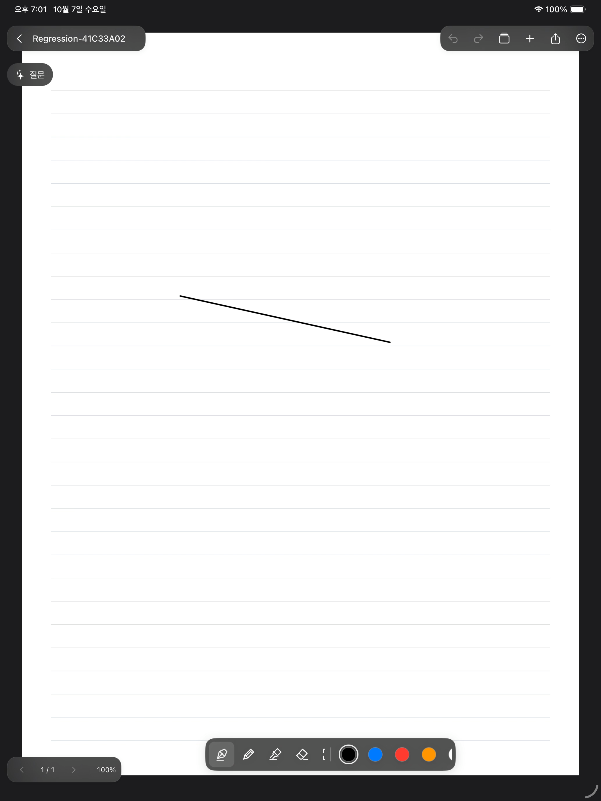

# 노트 여백 · note margin

iPad에서 PDF를 읽고 Apple Pencil로 필기하며, 선택한 내용에 대해 AI와 대화하는 노트 앱입니다.

## 필기와 편집

- 펜·연필·형광펜, 획·부분 지우개, 다섯 가지 사용자 지정 색상
- 끝점에서 잠시 멈추면 선·원·타원·직사각형 자동완성
- 도형 이동과 비율을 유지한 크기 조절, 자유형·박스형 필기 선택
- 실행 취소·다시 실행, 필기 복제·잘라내기·복사·붙여넣기·그룹·삭제
- 줄·격자·점 용지, 고정 페이지와 무한 캔버스

## 프로젝트와 자료

- 하위 프로젝트와 노트를 함께 관리하고 길게 눌러 이동
- PDF를 페이지별로 열거나 세로로 이어 붙여 필기
- 로컬 파일 가져오기, Google Drive 연결과 PDF 선택¹
- 텍스트·사진 삽입, PDF·이미지 공유, 자동 저장
- 최근 삭제된 노트 복원 및 휴지통 전체 영구 삭제

## 여백 대화

선택한 PDF·필기를 이미지로 보내 질문하고, 같은 대화에서 후속 질문을 이어갑니다. ChatGPT 구독 연결, 질문 유형별 기본 질문, 수식 표시를 지원합니다.

¹ Google Drive는 앱 빌드에 Google OAuth 클라이언트 등록이 필요합니다. 기본 NoteMargin 타깃에는 제공된 iOS Client ID가 설정되어 있습니다. Google Cloud의 API 활성화·동의 화면 설정 확인과 실제 계정 검증은 별도로 필요합니다.
