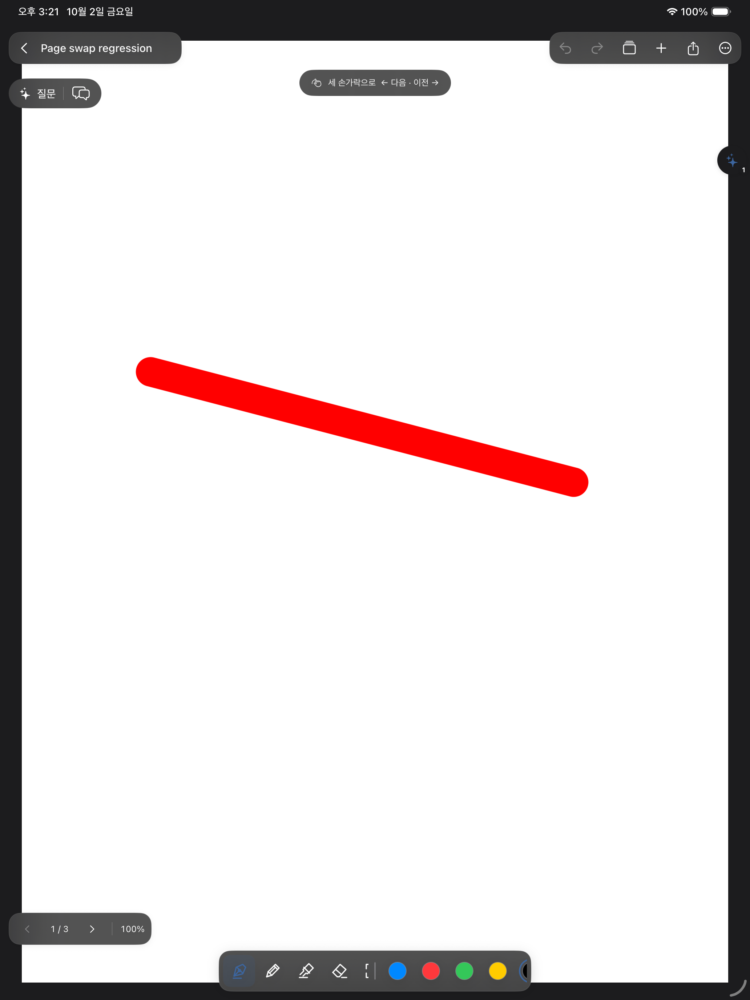
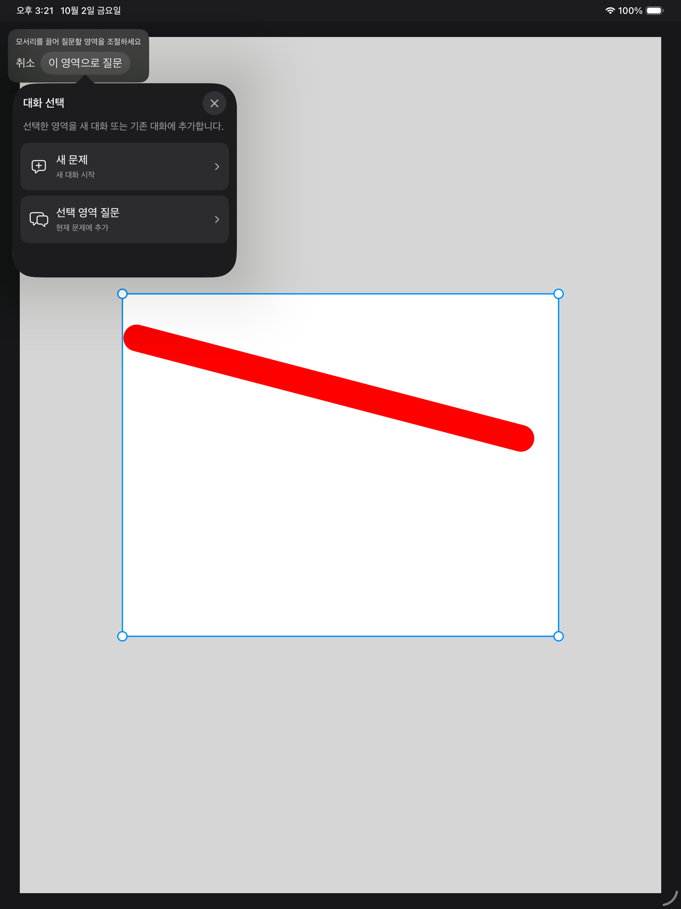

# 노트 도구·화면·가져오기 수정 (2026-10-02)

## 원인과 수정

| 증상 | 확인한 원인과 수정 경로 |
| --- | --- |
| AI 질문 중 홈 버튼 겹침 | `LibraryView`의 홈 툴바를 노트 route가 없을 때만 구성한다. `AIEditorCanvas`의 영역 선택·대화 선택·채팅 표시 상태를 `EditorView`에 전달해 노트 제어 버튼도 숨긴다. |
| 노트를 다시 열면 펜 굵기 초기화 | 새 `DrawingSession`이 기본값으로 만들어졌다. 펜·연필·형광펜별 굵기·색·자 설정, 마지막 펜과 지우개 모드를 기기 내 UserDefaults에 저장하고 새 세션의 실제 PencilKit 도구에 복원한다. |
| 획 지우개 굵기 변경 불가 | 실측한 PencilKit `.vector`의 `validWidthRange`와 `width`는 모두 0이며 지정 폭을 무시했다. 앱의 획 삭제 트랜잭션에 독립적인 4–80pt 설정값을 전달해 판정 범위와 미리보기 폭을 함께 변경한다. |
| 최대 축소 시 용지 튕김 | 확대축소 중 inset과 offset 보정이 따로 적용되던 경로를 묶었다. 화면보다 작은 축은 즉시 중앙에 고정하고 확대축소 바운스를 끈다. 저장에 따른 단순 재배치는 현재 위치를 보정하지 않는다. 화면 맞춤의 절반 배율은 유지한다. |
| 확대 상태 부분 지우개 지연 | 네이티브 `fixedWidthBitmap`을 사용한다. 지우는 동안 같은 drawing의 중복 조회·선택 검증·undo UI 갱신과 선택용 미리보기 준비를 줄인다. 최신 drawing 저장 큐는 계속 갱신해 중간 저장을 보존한다. |

지우개는 한 버튼으로 통합했다. 선택한 지우개를 다시 누르면 작은 설정창에 **획 / 부분**과 굵기가 나타난다. 지운 뒤 마지막 펜으로 돌아가는 동작을 유지한다.

위아래 전체 폭의 검은 판 대신 작은 material 배경의 노트 도구와 페이지·배율 버튼을 배치했다. 표시를 숨겨도 실제 캔버스 크기와 위치는 바꾸지 않는다. AI 질문을 넣을 대화 선택창은 불투명한 시스템 배경과 기본 전경색을 사용한다.

프로젝트는 저장된 색상의 채워진 폴더와 같은 색의 사이드바 점으로 표시한다. PDF 가져오기에는 Google Drive 안내와 시스템 문서 선택기를 연결했다. 자세한 설정은 [Google Drive 가져오기 안내](project-colors-and-drive-import.md)를 참고한다. 앱 자체 Google OAuth 로그인은 추가하지 않았으며, Drive 앱과 iPad 파일 제공자를 사용한다.

아래는 다크 모드 iPad 시뮬레이터의 실제 앱 화면이며, 빨간 획은 검증용 합성 필기다.





## 저장 호환

- 기존 노트·PDF·필기·대화 파일을 변환하거나 덮어쓰는 마이그레이션은 없다.
- 도구 설정은 `noteMargin.inkTools.preferences.v1` 키에만 추가 저장한다. 잘못된 설정은 기본값으로 복구한다.
- 프로젝트 `cover`는 선택 필드다. 기존 프로젝트는 파란색으로 표시되며 이름만 바꾸는 기존 경로도 색상을 보존한다.
- 외부 PDF는 보안 범위 안에서 조정된 파일 읽기를 수행하고 바이트 사본을 기존 가져오기 계층에 넘긴다. 읽기 실패나 취소는 새 노트를 만들지 않는다.

## 변경 파일

- `Canvas/DrawingSession.swift`, `Canvas/NotebookCanvas.swift`: 도구 설정, 지우개 처리, 뷰포트 보정.
- `Views/Design.swift`, `Views/EditorView.swift`, `Views/AIEditorCanvas.swift`: 지우개 팝업, 작은 노트 제어 UI, 읽기 쉬운 대화 선택.
- `Views/LibraryView.swift`, `Core/Models.swift`, `App/NoteStore.swift`: 홈 툴바 표시, 프로젝트 색상, PDF 데이터 가져오기 연결.
- `Views/PDFImportSourceView.swift`, `Services/PDFImportReader.swift`: 파일·Drive 선택과 조정된 사본 읽기. 두 파일을 기존 Xcode 소스 빌드 단계에 등록했다.
- `scripts/editor_viewport_checks.swift`, `scripts/ink_tool_preferences_checks.swift`, `scripts/project_import_checks.swift`: 새 회귀 검사. 기존 통합·UI 검사에 연결했다.

위 앱 파일 경로는 저장소의 `NoteMargin/` 기준이다. 기존 사용자 변경을 보존해 `/Users/whans/Documents/IPAD`에도 반영했으며, 서명·계정 설정은 수정하지 않았다.

## 실행한 검증

```sh
swift run --scratch-path /private/tmp/NoteMarginEditorCoreChecks CoreChecks

xcrun swiftc -parse-as-library -module-cache-path /private/tmp/NoteMarginImportModuleCache \
  NoteMargin/Core/Models.swift NoteMargin/Core/LibraryRepository.swift \
  NoteMargin/Services/PDFImportReader.swift scripts/project_import_checks.swift \
  -o /private/tmp/note-margin-project-import-checks
/private/tmp/note-margin-project-import-checks

python3 scripts/check_pdf_import.py --plan \
  --reuse-work /var/folders/wb/hzygp7510z38b4vblx_m9xh00000gn/T/NoteMarginPDFChecks-vdgdh2_6

python3 scripts/check_pdf_import.py --live-ui \
  --reuse-work /var/folders/wb/hzygp7510z38b4vblx_m9xh00000gn/T/NoteMarginPDFChecks-vdgdh2_6 \
  --only-testing CanvasLiveInkTests/InkToolsVisualTests/testFloatingEditorControlsAndReadableCaptureDestination \
  --only-testing CanvasLiveInkTests/InkToolsVisualTests/testSingleEraserRetapSettingsAndRememberedMode \
  --only-testing CanvasLiveInkTests/StrokeEraserVisualTests


# 최종 확대 상태 지우개 검사 및 획 지우개 단독 재실행
python3 scripts/check_pdf_import.py --live-ui \
  --reuse-work /var/folders/wb/hzygp7510z38b4vblx_m9xh00000gn/T/NoteMarginPDFChecks-vdgdh2_6 \
  --only-testing CanvasLiveInkTests/InkToolsVisualTests/testSingleEraserRetapSettingsAndRememberedMode
python3 scripts/check_pdf_import.py --live-ui \
  --reuse-work /var/folders/wb/hzygp7510z38b4vblx_m9xh00000gn/T/NoteMarginPDFChecks-vdgdh2_6 \
  --only-testing CanvasLiveInkTests/StrokeEraserVisualTests

xcodebuild -quiet -project /Users/whans/Documents/IPAD/NoteMargin.xcodeproj \
  -scheme NoteMargin -configuration Debug -sdk iphoneos \
  -destination 'generic/platform=iOS' -derivedDataPath /private/tmp/NoteMarginToolsXcode \
  CODE_SIGNING_ALLOWED=NO build
git diff --check
```

- CoreChecks: **65/65 통과**.
- 프로젝트·가져오기 검사: 구버전 호환, 색상 저장·재로드·이동, 파일 사본 독립성, 원본 보존, 오류·취소 검사 통과.
- iPad 시뮬레이터 통합 검사: **통과**. 기존 필기 저장·이동·크기 변경·외관·그룹·PDF·AI 맥락 검사와 새 도구 설정 복원, 획 지우개 4/80pt 삭제 범위, 부분 지우개 실제 폭, 61단계 축소와 80,000pt 연속 용지 위치 검사 포함.
- 실제 Xcode 체크아웃의 iPad SDK Debug 빌드: **통과** (서명 제외).
- UI 터치 검사: 아래 **3개 시나리오를 개별 재실행으로 통과**했다.
  - 홈→노트→질문 영역·대화 선택→홈: 홈 버튼이 노트 위에 나타나지 않음, 캔버스 크기 불변, 선택창 글씨 대비, Drive 안내 경로.
  - 지우개 재터치→획/부분→굵기→이전 선택 복원→**200% 캔버스**에서 부분 삭제→원래 펜 복귀: 실제 확대값, 삭제 픽셀 감소, 남은 획과 확대값 보존을 확인했다. 확대 상태 설정에는 테스트 전용 버튼의 `setZoomScale`을 사용했다.
  - 실제 터치 획 지우개: 접촉 중 반투명·흰 지우기 영역, 펜을 뗄 때 삭제, 이전 펜 복귀, 취소·Undo/Redo.

자동 두 손가락 핀치의 배율 변경 검사는 **통과하지 못했다**. 기존 편집기와 앱 코드 없는 기본 `PKCanvasView` 비교 모두 이 iPadOS 26.5 시뮬레이터에서 배율이 변하지 않았다. 따라서 위 200% 지우개 검사를 실제 핀치 통과로 집계하지 않는다. 61단계 배율·위치 회귀는 프로그램으로 배율을 변경한 검사이며, 실제 기기의 최소 배율 핀치와 반동은 확인이 남아 있다. 진단용 코드·타이머는 제품에서 사용하지 않는다.

중간에 테스트가 잡은 위치 보정 회귀와 vector 지우개의 폭 무시를 수정한 후 통합 검사를 다시 통과했다. 새 UI 테스트의 복잡한 Swift 표현식 때문에 발생한 테스트 컴파일 실패도 단순한 반복문으로 수정했다. UI 접근성 식별자가 자식 버튼을 덮던 문제를 고쳤으며, 획 지우개 픽셀 검사는 전체 PNG를 매 프레임 만들던 계측 부하를 줄인 뒤 재실행했다.

## 앱에서 확인

1. Xcode의 `IPAD/NoteMargin.xcodeproj`에서 `NoteMargin`을 iPad로 실행한다.
2. 펜 굵기·색을 변경하고 홈으로 나왔다가 노트를 다시 연다. 설정이 유지되는지 확인한다.
3. 지우개를 두 번 눌러 획/부분과 굵기를 바꾼다. 필기를 지운 뒤 이전 펜으로 돌아가는지 확인한다.
4. PDF를 확대했다가 최소 배율까지 축소한다. 작은 용지가 중앙에 유지되는지 확인한다.
5. 질문 영역을 선택하고 새 문제/기존 대화를 고른다. 홈 버튼이 겹치지 않고 대화 선택 글씨가 읽히는지 확인한다.
6. 프로젝트 설정에서 폴더 색을 바꿔 홈 폴더와 사이드바 점을 확인한다.
7. Drive 앱 로그인과 파일 앱의 Drive 위치를 활성화한 후 **PDF 가져오기 → Google Drive에서 선택**으로 PDF를 고른다.

실제 Apple Pencil의 기기별 지연·프레임 속도와 실제 Google Drive 계정 다운로드는 아직 검증하지 않았다. 시뮬레이터 검사는 합성 필기와 터치 입력을 사용하며 AI 질문을 실제 계정에 전송하지 않는다.
