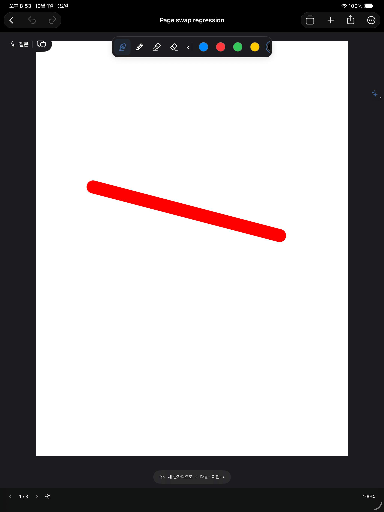
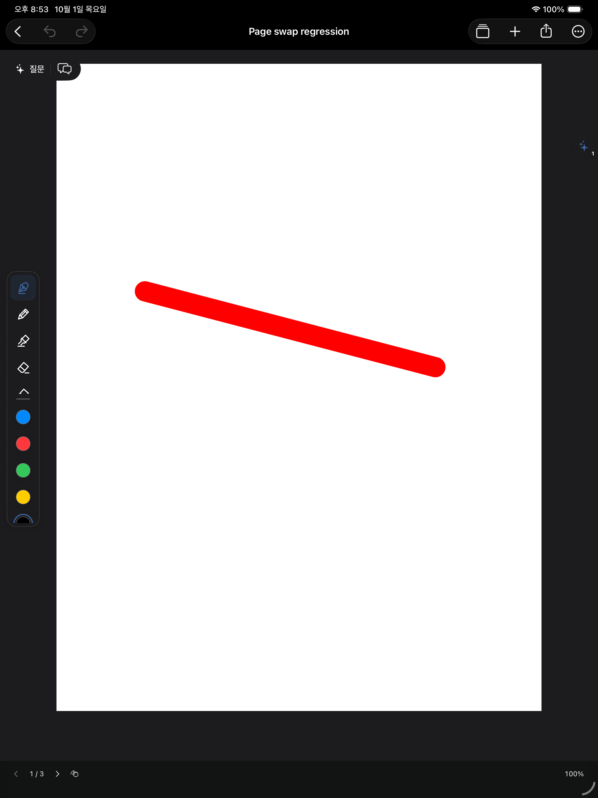
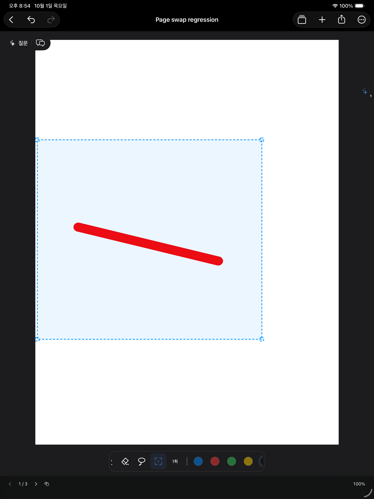

# 팔레트·필기 입력 개선

> 후속 수정: 지우개·선택의 이미지 미리보기와 종이의 형제 뷰 구조는 [필기 지우개·선택 최적화](vector-ink-interactions.md)의 벡터 미리보기·공통 스크롤 부모 구조로 교체되었습니다. 아래는 이전 개선 기록입니다.

## 동작

- 펼친 팔레트는 한 줄이다. 가운데 구분선은 고정이며 이동 손잡이를 겸한다. 도구와 색상은 독립 스크롤한다. 좌우 가장자리에서는 세로 한 줄, 위아래에서는 가로 한 줄이다.
- 5개 색상은 기존 설정을 유지한다. 선택된 색상을 다시 누르면 편집한다.
- 매획 저장 중/저장됨 표시는 제거했다. 자동 저장, 저장 실패 안내, 더 보기 → 지금 저장은 유지한다.
- 네모로 선택한 필기는 안쪽을 끌어 이동하고 모서리를 끌어 확대·축소한다. 선택된 필기가 없는 네모는 선택 범위를 조절한다.
- 화면 맞춤의 50%까지 축소할 수 있다. 표시되는 100%는 기존 화면 맞춤 기준이다.
- 펜 굵기를 0.1까지 선택할 수 있다. 기본 PencilKit pen은 작은 값을 자체 최솟값으로 올리므로, 그보다 가는 구간에는 네이티브 monoline을 사용한다. 필기 후 획을 축소하는 방식은 사용하지 않는다.

## 원인과 수정 경로

### 선택 이동

기존 `updateInkDrag`는 테두리만 이동했고 PKDrawing은 제스처가 끝나야 바뀌었다. 이제 제스처 시작 시 선택/비선택 필기를 한 번 렌더하고 선택된 필기와 테두리에 동일한 transform을 적용한다. 텍스처는 최대 2048px로 제한한다. native canvas는 숨기지 않아 두 번째 손가락 제스처가 유지된다. 끝날 때 한 번 확정하고 PencilKit 렌더 완료까지 미리보기를 유지한다. 취소는 원본을 복원하며 이동/크기 변경은 기존 undo와 저장 경로를 사용한다.

### 입력과 저장

`DrawingSession → NoteStore.queueDrawing`은 이제 PKDrawing 값과 revision만 보관한다. 매 콜백의 전체 직렬화를 제거했다. 펜이 닿아 있는 동안 자동 저장 시작과 저장 완료 UI 반영을 보류한다. 마지막 필압 콜백은 계속 수신한다. 유휴 700ms 뒤 직렬화·파일 저장을 직렬 백그라운드 큐에서 수행한다. 강제 저장과 메타데이터 수정도 같은 큐의 순서를 지키며 이전 콜백이 최신 revision을 지우지 않는다. 실패하면 pending 원본을 유지한다.

### 확대·이동

PDF를 매 scroll/zoom마다 UIView.draw로 재래스터하지 않는다. 문서 좌표에 고정된 768px 타일을 캐시하고 native canvas의 zoom/offset과 같은 transform을 애니메이션 없이 적용한다. 새로 보이는 범위와 확대 해상도가 달라질 때만 타일을 갱신한다. 긴 PDF 전체를 한 장으로 할당하지 않으며 큰 축소 때 고해상도 캐시가 폭증하지 않도록 제한한다. 확대 해상도 보정은 펜 입력 중 중단한다. 핀이 없는 페이지의 불필요한 SwiftUI viewport 갱신과 중복 undo UI 갱신도 줄였다.

PencilKit의 기존 저지연 입력·예측·라이브 렌더링 엔진을 그대로 사용한다. 캔버스 전체를 외부 스크롤 뷰로 확대하거나 내부 비공개 서브뷰에 의존하지 않는다.

## 데이터 영향

기존 .drawing 및 library.json 포맷 그대로이며 마이그레이션은 없다. 필기 원본, AI 채팅/첨부, 노트 및 프로젝트는 유지한다. 테스트는 com.notemargin.integrationcheck 격리 앱에서만 실행한다.

## 검증 절차

1. 팔레트의 도구/색상 쪽을 각각 스와이프하고 구분선이 움직이지 않는지 확인한다. 구분선을 끌어 네 가장자리에 놓는다.
2. 글씨를 여러 획 쓰고 저장 배너가 나타나지 않는지 확인한다.
3. 네모로 필기를 선택해 안쪽을 천천히 끈다. 손을 떼기 전에도 필기와 테두리가 함께 움직여야 한다. 모서리로 줄이고 늘린 뒤 실행 취소한다.
4. PDF 위에 필기한 뒤 두 손가락으로 확대·이동하고 50%까지 축소한다. 배경과 필기가 같은 위치를 유지해야 한다.
5. 펜 굵기를 0.1로 정하고 확대된 PDF에 작은 글씨를 쓴다.
6. 앱을 재실행해 마지막 획과 편집 결과가 남아 있는지 확인한다.

시뮬레이터 검사와 실제 Apple Pencil 지연 측정은 구분한다. 실제 iPad의 주사율·발열·PDF 복잡도에 따른 체감 지연은 실기에서 확인해야 한다. 타일 최초 생성은 여전히 메인 스레드의 제한된 래스터 작업이므로, 모든 PDF에 대해 특정 ms의 지연을 보장하지 않는다.

## 실행한 검사

- `swift run --scratch-path /private/tmp/note-margin-memory-core CoreChecks`: 65/65 통과.
- `python3 scripts/check_pdf_import.py --plan`: 저장 30개, 대화 저장/요청 60개, 실제 PencilKit 선택 이동 픽셀·크기·취소·undo/redo·재열기, PDF/필기 캡처, 50% 축소 및 캐시 재사용, 네이티브 0.1 굵기 검사 통과.
- 첫 굵기 검사는 기본 `.pen`이 0.1을 그대로 적용한다는 가정을 실제로 실패시켰다. 시뮬레이터에서 기본 펜의 클램프를 확인하고 가는 구간을 수정한 다음 위 검사를 통과했다.
- 대화 검사는 모의 전송/격리 저장 검증이다. 실제 ChatGPT 계정으로 새 요청을 보내지는 않았다.
- 실제 터치 UI 첫 실행: 7개 중 5개 통과(긴 PDF 라이브 필기, 페이지 잔상, 획 지우개, 5색 편집/재실행, 가는 굵기/조용한 저장). 2개는 선택 버튼을 노출하는 테스트의 190pt 고속 스와이프가 양끝을 왕복해 실패했다. 이벤트 기록을 확인하고 해당 helper를 70pt 이하의 느린 드래그로 수정했다.
- `/Users/whans/Documents/IPAD/NoteMargin.xcodeproj`의 `NoteMargin` 스킴을 `generic/platform=iOS`, `CODE_SIGNING_ALLOWED=NO`로 빌드해 성공했다. 실제 iPad 설치·Apple Pencil 실기 측정은 이 빌드 검사에 포함되지 않는다.
- Xcode 동기화 전 대상 파일을 `/private/tmp/NoteMargin-Xcode-before-ink-performance-20261001`에 백업하고 전후 SHA-256을 확인했다. 기존 프로젝트 파일·scheme·서명 설정은 보존했다.

- 실패했던 두 UI 검사를 짧은 스크롤 제스처로 재실행해 2/2 통과했다. 관련 고유 UI 검사 총 7개가 통과했다. 선택 모서리 축소/확대는 밝은·어두운 모드에서 실제 잉크 픽셀 증감을 검사했다.
- 재실행 명령: `python3 scripts/check_pdf_import.py --live-ui --only-testing CanvasLiveInkTests/InkToolsVisualTests/testRectangleAndPictogramsInBothAppearances --only-testing CanvasLiveInkTests/InkToolsVisualTests/testSingleRowRailsScrollIndependently`

## 실제 시뮬레이터 화면

