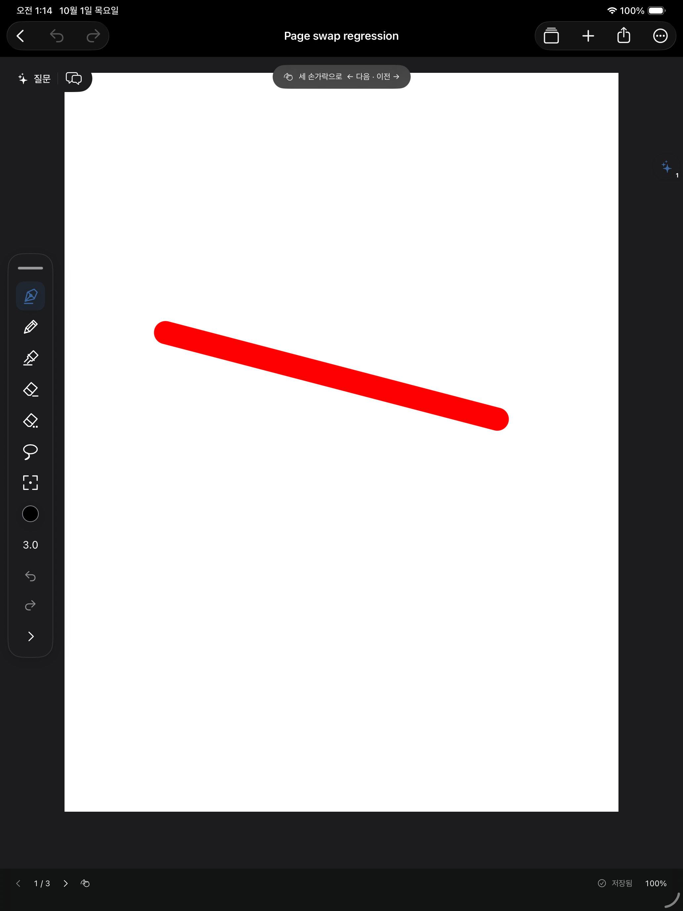
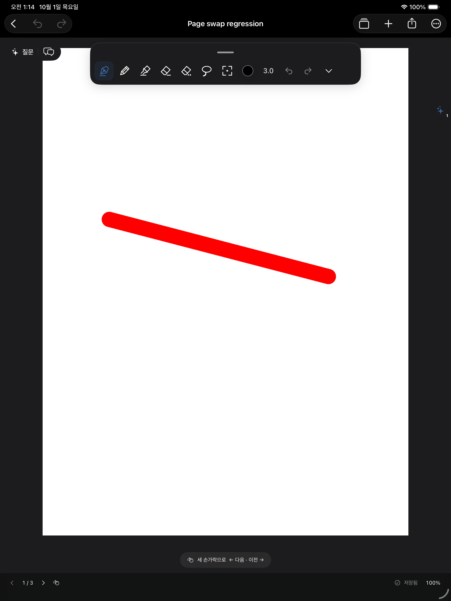

# 가장자리 방향 팔레트와 지우개 후 펜 복귀

- 좌우 가장자리는 폭 68pt, 위아래는 높이 96pt로 길게 배치한다. 원형으로 접기와 위치 저장은 유지한다. 색상·굵기·자 설정은 해당 버튼의 팝오버에 배치하며, 작은 창에서는 도구 목록을 스크롤할 수 있다.
- 손가락 위치로 가장자리를 결정하고 새 팔레트 크기로 화면 안쪽 위치를 제한한다. 방향 전환 때 달라지는 크기가 가장자리 선택에 영향을 주지 않도록 했다.
- 펜·연필·형광펜을 떠날 때 마지막 종류·색상·굵기·자 설정을 DrawingSession에 기억한다. 획 지우개는 삭제 확정 직후, 부분 지우개는 PencilKit의 도구 사용 종료 콜백 이후 복원한다. 빈 곳에서 지우개를 떼어도 복귀한다.
- 획 지우개 취소 시에는 삭제와 자동 복귀를 하지 않는다. 지우기 미리보기는 복귀 과정에서 강제로 지우지 않고 기존 렌더 완료 경로로 정리한다. 원본 필기, Undo/Redo, 저장 구조를 변경하지 않는다.

수정 파일: `Views/Design.swift`, `Canvas/DrawingSession.swift`, `Canvas/NotebookCanvas.swift`. 회귀 검사: `scripts/ink_selection_checks.swift`, `scripts/canvas_ui_checks.swift`, `scripts/pdf_integration_app.swift`.

## 실행한 검증

- `python3 scripts/check_pdf_import.py --live-ui --only-testing CanvasLiveInkTests/InkToolsVisualTests --only-testing CanvasLiveInkTests/StrokeEraserVisualTests`: **2개 UI 테스트 통과, 실패 0**. iPad Pro 13-inch (M5), iOS 26.5 Simulator.
- 첫 테스트는 밝은/어두운 모드 각각에서 상단·좌측·우측 도킹 시 실제 도구 좌표의 방향을 검사하고 원형 접기·펼치기, 네모 선택·복제·삭제를 확인한다.
- 두 번째 테스트는 실제 지우기 터치 중 반투명/흰 자국, 펜을 뗐을 때 삭제 및 마지막 연필/굵기 복귀, Undo/Redo, 취소 시 원본 유지, 부분 지우개 후 복귀를 검사한다.
- 위 UI 앱이 시작될 때 도킹 기하와 펜/연필/형광펜 × 두 지우개 조합의 설정 복원 검사도 실행한다.
- `xcodebuild -quiet -project /Users/whans/Documents/IPAD/NoteMargin.xcodeproj -scheme NoteMargin -configuration Debug -sdk iphoneos -destination 'generic/platform=iOS' -derivedDataPath /private/tmp/NoteMarginToolsXcode CODE_SIGNING_ALLOWED=NO build`: 종료 코드 0. Xcode 사용 폴더 반영 및 서명 없는 iPad용 빌드 성공.
- `git diff --check`: 통과. 실제 iPad/Apple Pencil 터치 검사는 수행하지 않았다.

테스트용 필기가 들어 있는 실제 시뮬레이터 화면:

