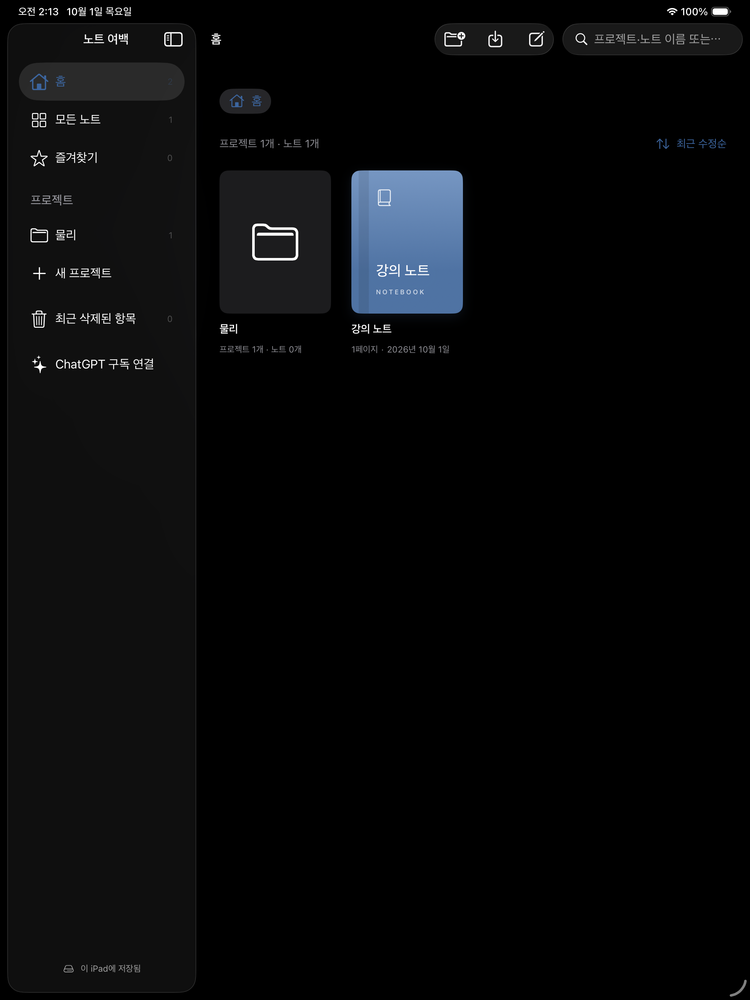
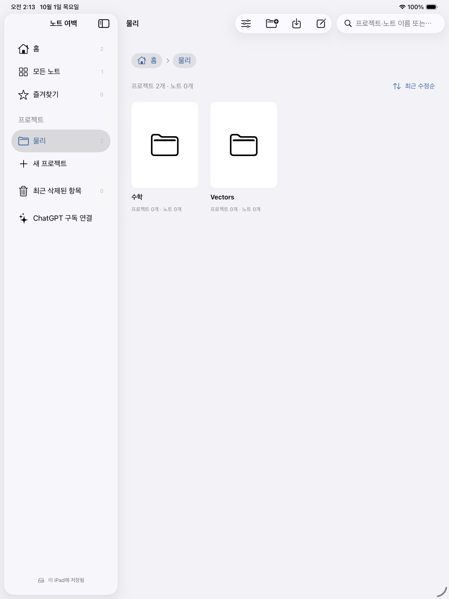
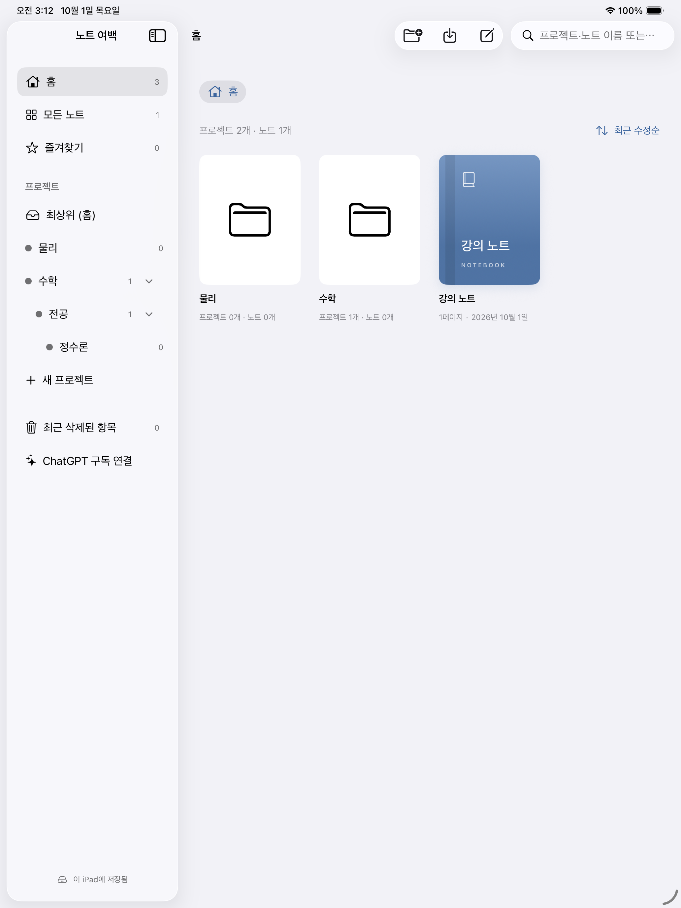
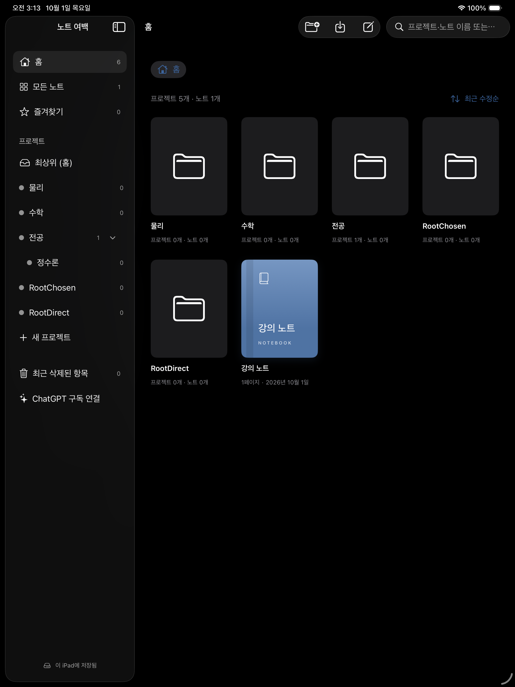

# 프로젝트 디렉토리

홈 화면에는 최상위 프로젝트와 노트를 함께 표시합니다. 프로젝트 안에는 하위 프로젝트와 노트를 둘 수 있습니다. 홍보 문구 대신 현재 위치, 항목 수, 이름을 표시합니다. 모든 노트·즐겨찾기·휴지통은 별도 보기로 유지합니다.

## 조작

- 프로젝트를 탭하면 하위 항목이 표시됩니다. 상단 경로로 상위 위치나 홈으로 돌아갑니다.
- 프로젝트 또는 노트를 길게 누르면 설정·이동 메뉴가 표시됩니다. 누른 상태로 끌어 프로젝트 카드 위에 놓으면 해당 프로젝트로 이동합니다.
- 상단 경로 또는 사이드바의 홈·프로젝트도 드롭 위치입니다. 이동 메뉴에서는 전체 프로젝트 경로로 목적지를 고를 수 있습니다.
- 상단 도구 모음의 새 프로젝트는 현재 위치를 기본값으로 사용합니다. 사이드바의 새 프로젝트는 최상위를 기본값으로 사용합니다. 생성·설정 화면의 상위 프로젝트 선택에서 최상위나 다른 프로젝트를 선택할 수 있습니다. 새 노트와 PDF는 현재 프로젝트에 저장됩니다.
- 프로젝트 삭제는 컨테이너만 삭제합니다. 직접 속한 하위 프로젝트와 노트(휴지통 포함)는 상위 위치로 이동합니다.
- 자신이나 자신의 하위 프로젝트로 이동하는 동작, 없는 항목·목적지, 휴지통 노트 드래그는 저장 단계에서 차단합니다.

## 저장 및 이전

기존 `library.json`에 프로젝트 `parentID`와 일회성 이전 표시 `projectsMigrated`를 추가합니다. 기존 파일 형식 버전과 노트·첨부·필기 저장 경로는 유지합니다. 별도 DB는 없습니다.

앱이 처음 새 구조를 읽으면 `library-before-projects.json`에 기존 인덱스를 복사하고 새 인덱스를 원자적으로 저장합니다. 백업이나 저장 실패 시 보관함을 열지 않고 오류를 표시합니다. 다시 실행해도 프로젝트를 중복 생성하지 않습니다.

- 각 기존 폴더를 프로젝트로 만듭니다. 가능하면 폴더 ID를 그대로 사용합니다.
- 프로젝트 소속이 없던 노트는 기존 폴더에 대응하는 프로젝트로 옮깁니다. 삭제된 노트도 동일하게 처리해 복원 시 위치를 유지합니다.
- 이미 프로젝트에 속한 노트는 프로젝트 ID를 유지합니다. 해당 프로젝트의 모든 노트가 같은 폴더에 있었다면 그 프로젝트 전체를 변환된 폴더 프로젝트 아래에 둡니다.
- 한 프로젝트의 노트가 여러 기존 폴더에 걸친 경우 기존 프로젝트 소속을 우선합니다. 기존 폴더 기록과 노트의 folderID는 복구 정보로 남기되 UI에는 노출하지 않습니다.
- 프로젝트 이동은 하위 노트와 AI 대화의 ID를 바꾸지 않습니다. 노트를 다른 프로젝트로 이동할 때 AI 대화를 현재 프로젝트로 제한하는 기존 규칙은 유지합니다.

## 변경 파일

- Core/Models.swift: 계층·이동 검증·폴더 이전·삭제 시 승격
- Core/LibraryRepository.swift: 이전 전 백업과 저장
- App/NoteStore.swift: 실제 앱 로딩 및 이동 저장 경로
- Views/LibraryView.swift: 프로젝트 홈, 경로, 메뉴, 드래그, 하위 생성
- Tests/CoreChecks/main.swift: 이전·순환 방지·저장 복원 회귀 검사
- scripts/pdf_integration_app.swift, scripts/canvas_ui_checks.swift: 격리된 시뮬레이터 홈 화면 검증

## 검증

- `swift run --scratch-path /private/tmp/note-margin-memory-core CoreChecks`: 64/64 통과. 폴더 이전·백업·원본 필기 보존, 혼합 소속, 다단계 이동·순환 차단, 저장 복원, 삭제 시 승격, 잘못된 드래그 입력을 포함합니다.
- `python3 scripts/check_pdf_import.py --live-ui --only-testing CanvasLiveInkTests/ProjectLibraryTests`: 1/1 통과. 프로젝트·노트 길게 누르기 메뉴, 프로젝트와 노트의 직접 드래그 진입, 이동 메뉴의 전체 경로, 홈으로 드래그 이동, 재실행 후 위치 유지, 현재 프로젝트에서 하위 프로젝트 생성을 검증했습니다. 격리된 iPad Pro 13-inch (M5), iPadOS 26.5 시뮬레이터에서 실행했으며 실제 사용자 노트나 로그인 계정은 사용하지 않았습니다.
- `xcodebuild -quiet -project /Users/whans/Documents/IPAD/NoteMargin.xcodeproj -scheme NoteMargin -configuration Debug -sdk iphoneos -destination 'generic/platform=iOS' -derivedDataPath /private/tmp/NoteMarginToolsXcode CODE_SIGNING_ALLOWED=NO build`: 기기용 빌드 성공. 서명·실제 iPad 설치는 이 검사에 포함되지 않습니다.

## 사이드바 계층과 최상위 이동 보완

사이드바에 하위 프로젝트를 들여쓰기로 표시하고 오른쪽 화살표로 접고 펼칩니다. 프로젝트 이름을 탭하면 열리고, 길게 누르면 설정 메뉴가 표시됩니다. 누른 채 다른 프로젝트 행으로 끌어 놓으면 해당 프로젝트 안으로 이동합니다. 하위 항목도 함께 이동하며, 자신이나 하위 프로젝트 안으로 이동하는 순환 구조는 차단합니다.

항상 표시되는 ‘최상위 (홈)’ 행에 놓으면 최상위로 이동합니다. 길게 누르기 메뉴의 ‘최상위로 이동’, 이동 위치 목록의 ‘최상위 (홈)’, 프로젝트 설정의 상위 프로젝트 선택도 같은 저장 경로를 사용합니다. 데이터 형식 변경이나 추가 마이그레이션은 없습니다.

최초 화면 테스트에서 SwiftUI List 사이드바의 행 드래그가 이동에 반영되지 않는 것을 확인했습니다. 사이드바를 ScrollView 목록으로 전환하고 각 행에 드래그·드롭을 연결했습니다. 격리된 UI 검사에 펼치기·접기, 사이드바에서 프로젝트 이동, 최상위 드롭, 다른 프로젝트를 보고 있을 때 최상위 생성, 재실행 복원을 추가했습니다.

최종 검증: CoreChecks 65/65 통과. `python3 scripts/check_pdf_import.py --live-ui --only-testing CanvasLiveInkTests/ProjectSidebarTests` 1/1 통과. iPadOS 26.5 시뮬레이터에서 사이드바 3단계 표시·접기·펼치기, 프로젝트 간 드래그, 하위 항목을 유지한 최상위 드롭, 사이드바에서 최상위 생성, 생성 메뉴에서 상위 위치를 최상위로 선택, 재실행 복원을 검사했습니다. 초기 실행의 제스처 및 선택자 실패는 최종 통과와 구분하며, 실제 iPad 제스처 검증은 수행하지 않았습니다. 최종 Xcode 폴더에서 서명을 생략한 기기용 빌드도 통과했습니다.

