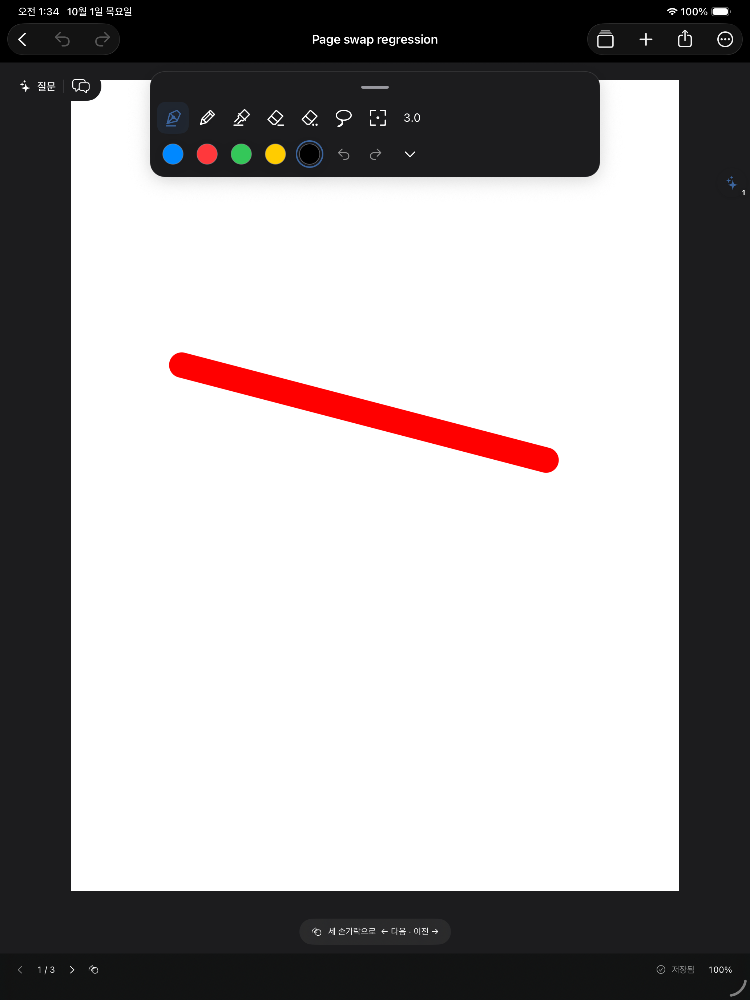
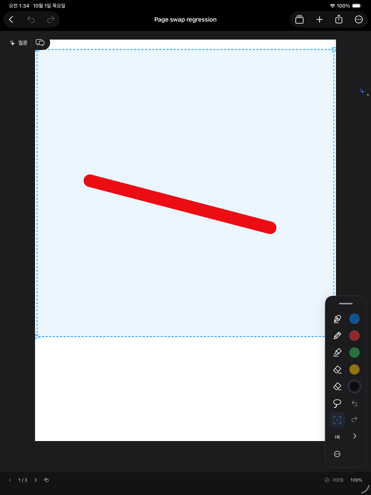

# 직사각형 선택 범위와 5색 팔레트

- 자유 선택은 PencilKit 올가미를 유지한다. 네모 선택은 별도 제스처가 시작점부터 반대 모서리까지 직사각형을 그린다. Pencil과 손가락 입력을 허용하고 네이티브 올가미·필기·한 손가락 스크롤과 경쟁하지 않도록 했다.
- 드래그로 만든 직사각형은 선택 완료 후에도 유지한다. 네 모서리를 움직이면 필기를 변형하지 않고 선택 범위를 바꾼다. 빈 사각형도 유지해 범위를 늘려 필기를 포함할 수 있다. 선택 안쪽 이동, 복사·잘라내기·복제·삭제와 Undo/Redo는 유지한다. 필기 자체 확대·축소는 편집 → 필기 크기 메뉴에서 실행한다.
- 팔레트에 색상 5칸을 직접 표시한다. 탭하면 선택하고, 선택된 칸을 한 번 더 탭하면 각 칸을 시스템 색상 선택기로 변경할 수 있다. 기본값은 검정·파랑·빨강·주황·흰색이다.
- 5개 sRGB 색상은 기존 앱 설정(UserDefaults)의 `inkTools.colors`에 저장한다. 기존 노트/필기/AI 데이터에는 마이그레이션이 없고 잘못된 슬롯만 기본색으로 복구한다.
- 위·아래 도킹은 도구/색상 두 줄, 좌우 도킹은 도구/색상 두 열을 사용한다. 지우개 뒤 이전 펜 복귀는 유지한다.

변경 소스: `Views/Design.swift`, `Canvas/DrawingSession.swift`, `Canvas/NotebookCanvas.swift`.

## 실제 검증 (2026-10-01)

- `python3 scripts/check_pdf_import.py --live-ui --only-testing CanvasLiveInkTests/InkToolsVisualTests --only-testing CanvasLiveInkTests/StrokeEraserVisualTests`: 5색 각각 변경·재실행 복원, 지우개 터치·펜 복귀 테스트 통과. 직사각형 검사는 팔레트에 가린 모서리를 누르는 테스트 좌표 문제로 실패하여 다음 실행에서 분리 재검증했다.
- `python3 scripts/check_pdf_import.py --live-ui --only-testing CanvasLiveInkTests/InkToolsVisualTests/testRectangleAndPictogramsInBothAppearances`: 최종 코드에서 **통과**. 밝은/어두운 모드, 좌우/상단 팔레트, 네모 드래그·모서리 확대 후 원본 필기 픽셀 보존, 복제·삭제, 접기·펼치기 검증. 첫 터치 좌표를 별도로 기억하여 제스처 인식 지연 때문에 시작 모서리가 이동하지 않도록 보완했다.
- UI 앱 시작 시 기존 PDF·선택/Undo 저장 검사, 빈 선택 범위 유지, 5개 임의 sRGB 색상 왕복 및 손상된 설정 복구 검사도 실행한다.
- `python3 scripts/check_pdf_import.py --plan`: 60개 저장/요청 검사와 수식·PDF 검사 통과.
- `xcodebuild -quiet -project /Users/whans/Documents/IPAD/NoteMargin.xcodeproj -scheme NoteMargin -configuration Debug -sdk iphoneos -destination 'generic/platform=iOS' -derivedDataPath /private/tmp/NoteMarginToolsXcode CODE_SIGNING_ALLOWED=NO build`: 최종 코드 종료 코드 0. 서명 없는 iPad 빌드이며, 실제 iPad/Apple Pencil 터치 검사는 수행하지 않았다.
- `git diff --check`: 통과. Xcode 폴더와 변경 소스의 바이트 일치 확인. 기존 프로젝트 서명 설정은 보존했다.

