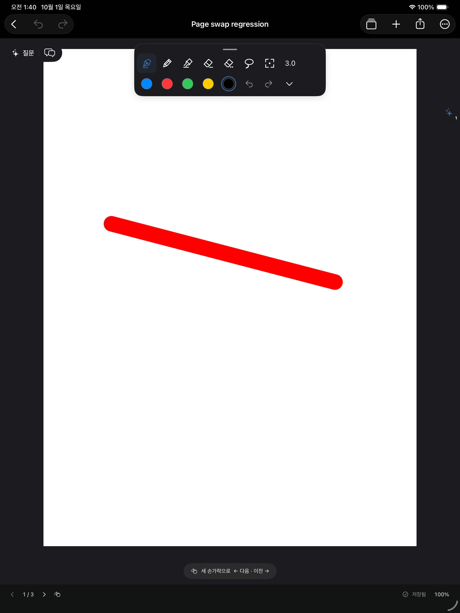

# 슬림 팔레트와 선택 색상 탭 편집

가로 팔레트의 최대 크기를 620×146pt에서 430×118pt로, 세로 팔레트를 116×478pt에서 104×440pt로 줄였다. 손잡이·행 간격·외곽 여백과 모서리 반경을 줄이고 아이콘/색상 원은 24pt로 통일했다. 도구 버튼과 색상 버튼의 터치 영역은 44×44pt를 유지한다. 작은 창의 도구 스크롤과 네 가장자리 도킹, 원형 접기, 5색 저장은 유지한다.

다른 색상은 한 번 탭해 선택하고, 이미 선택된 색상을 한 번 탭하면 변경 팝오버를 연다. 길게 누르기 메뉴는 제거했다. 동일한 색을 여러 슬롯에 저장해도 선택 표시와 편집 대상은 선택한 슬롯 하나를 따른다. VoiceOver 선택 상태와 안내도 변경했다.

수정 소스: `NoteMargin/Views/Design.swift`. 검증 코드: `scripts/canvas_ui_checks.swift`, `scripts/ink_selection_checks.swift`. 저장 형식 변경 없음.

## 검증 (2026-10-01)

- `python3 scripts/check_pdf_import.py --live-ui --only-testing CanvasLiveInkTests/InkToolsVisualTests`: **2개 테스트 통과, 실패 0**. 다른 색 첫 탭은 선택만 수행, 선택 색 재탭은 편집 창 열기, 5개 각각 변경·재실행 유지, 밝은/어두운 모드의 도킹·접기·네모 범위 조절·복제·삭제를 확인했다.
- `xcodebuild -quiet -project /Users/whans/Documents/IPAD/NoteMargin.xcodeproj -scheme NoteMargin -configuration Debug -sdk iphoneos -destination 'generic/platform=iOS' -derivedDataPath /private/tmp/NoteMarginToolsXcode CODE_SIGNING_ALLOWED=NO build`: 종료 코드 0. Xcode 폴더 반영 및 서명 없는 iPad 빌드 성공.
- `git diff --check`: 통과. 실제 iPad/Apple Pencil 검사는 수행하지 않았다.

